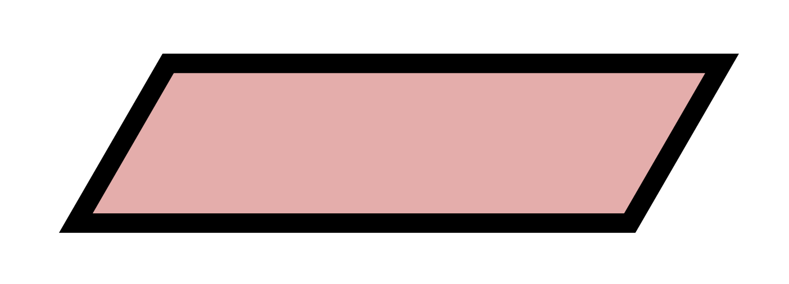
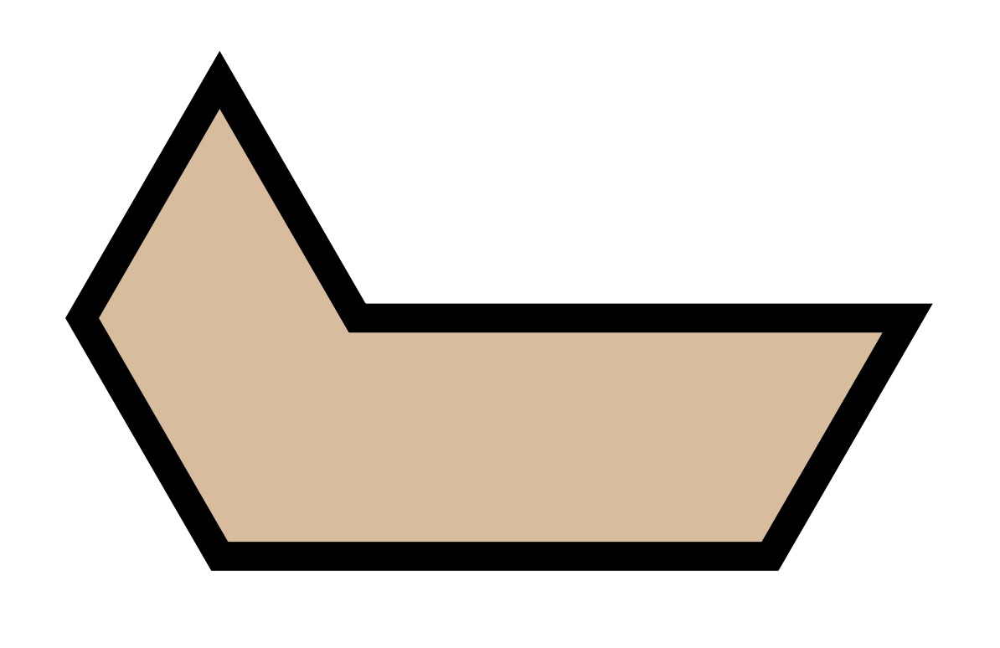
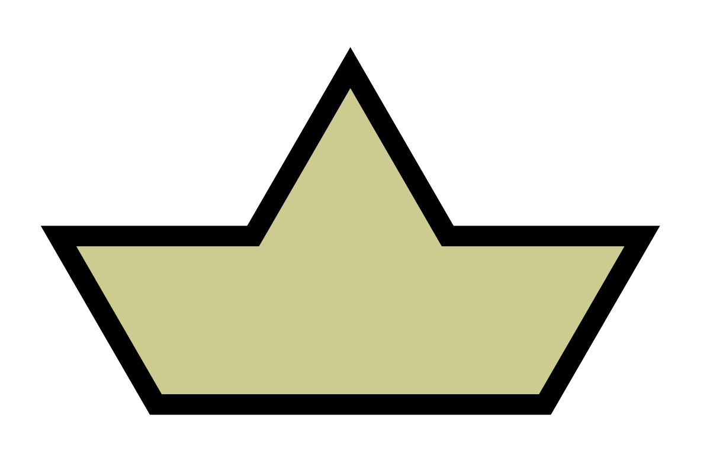
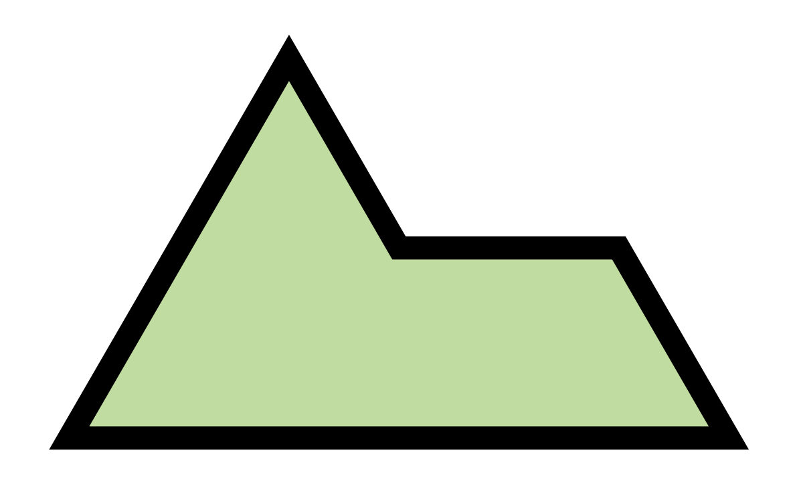
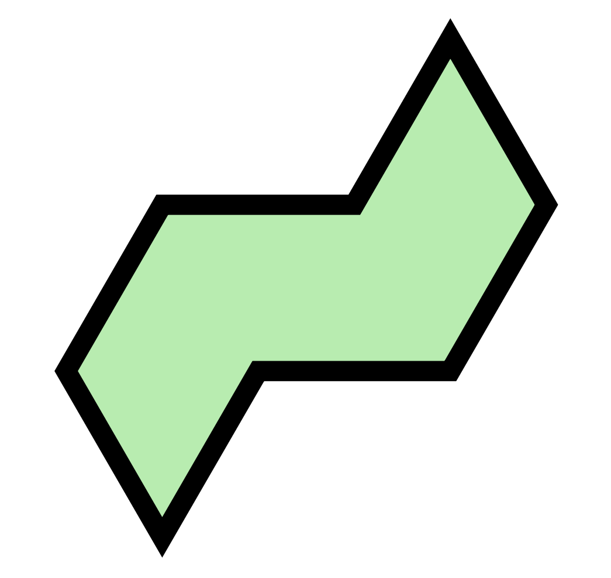
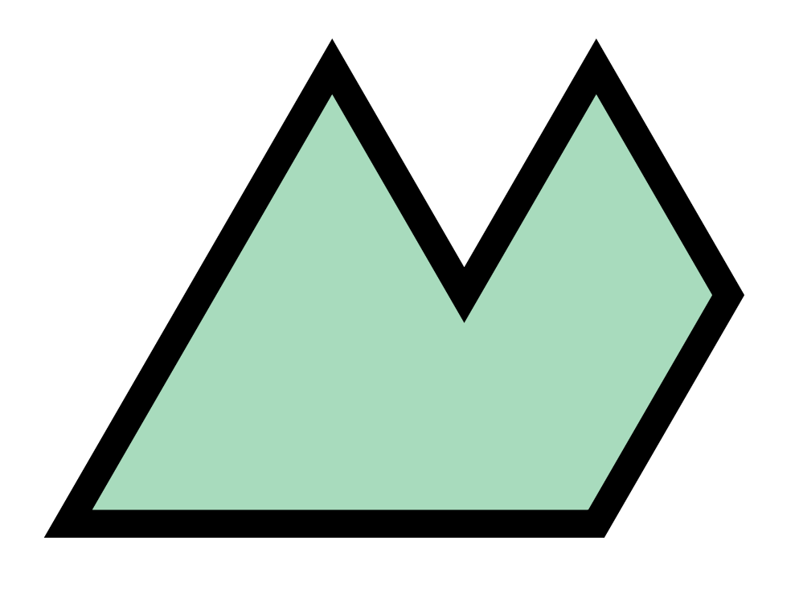
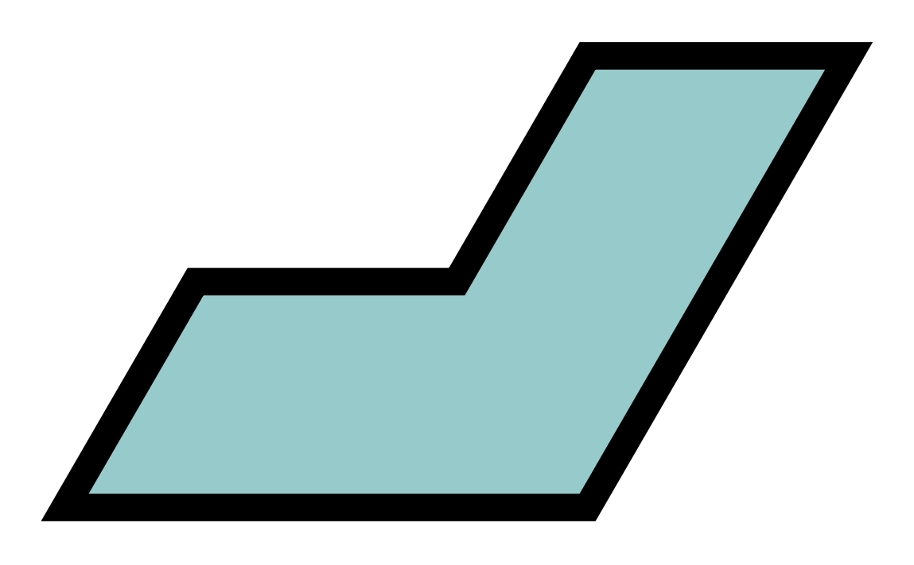
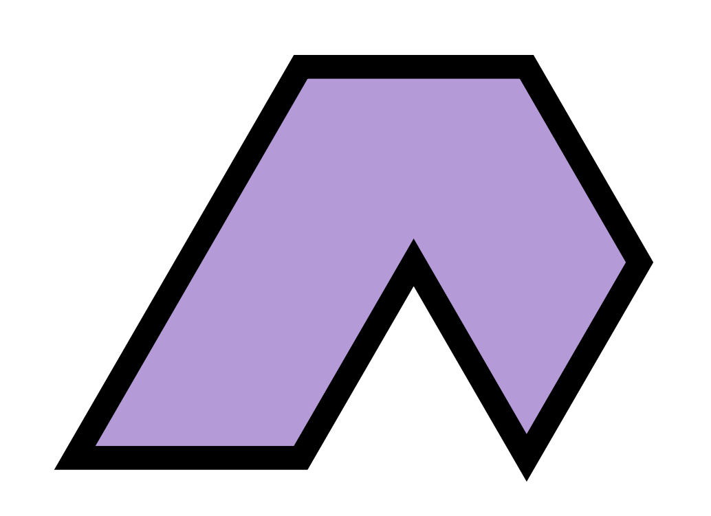
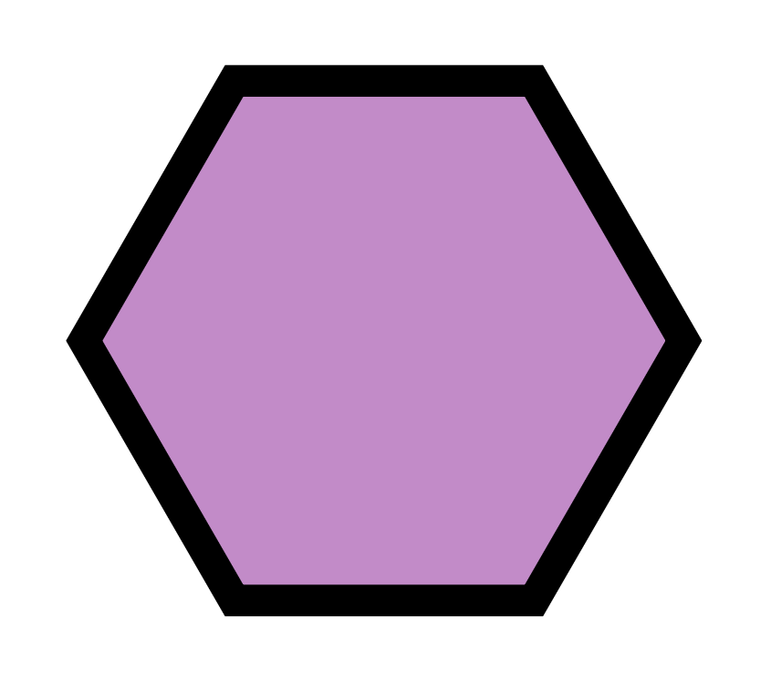
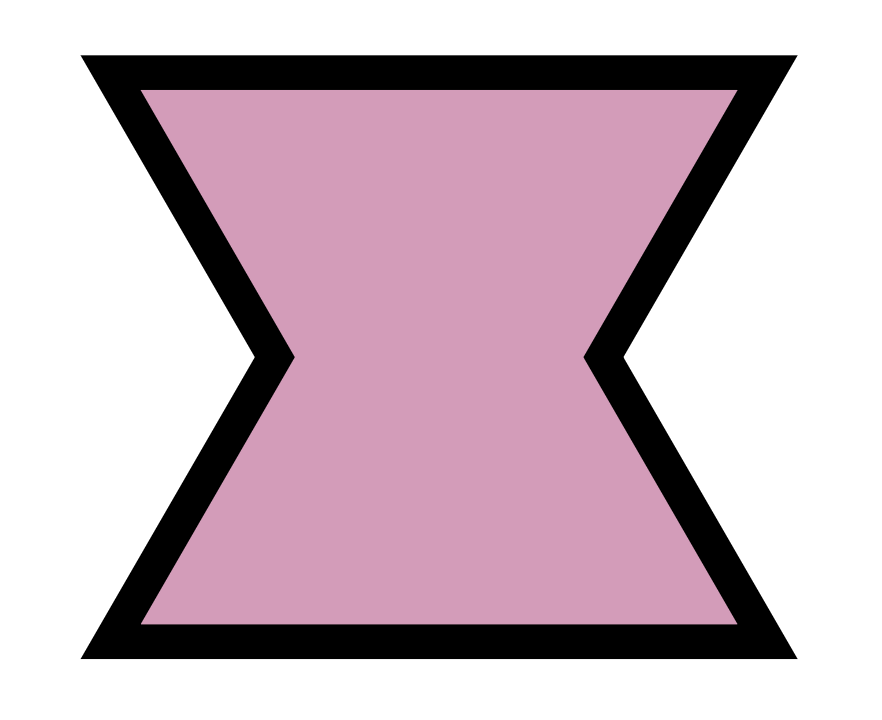

# Hexiamonds
Hexiamonds are polyiamonds composed of six equilateral triangles. Wolfram gives them the names

| bar | crook | crown | sphinx | snake | yacht | chevron | signpost | lobster | hook | hexagon | butterfly | 
| --- | ----- | ----- | -----  | ----- | ----- | ------- | -------- | ------- | ---- | ------- | --------- |
|  |    |    |     |    |    |      |       |      |   |      |        | 

# Eisenstein integers
The Eisenstein integers are numbers of the form $a + b\omega$, where $\omega = \frac{-1 + i\sqrt{3}}{2}$. $\mathbb{Z}\[\omega\]$ is a ring whose elements form a triangular lattice.

A triangle in the lattice can be uniquely defined as a set of three Eisenstein integers, and a set of six connected triangles corresponds to a unique hexiamond orientation and position in the lattice.

