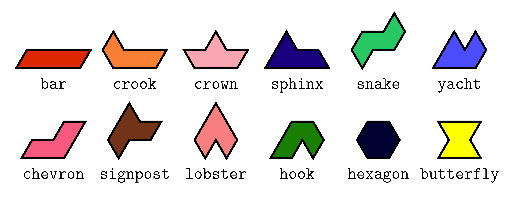
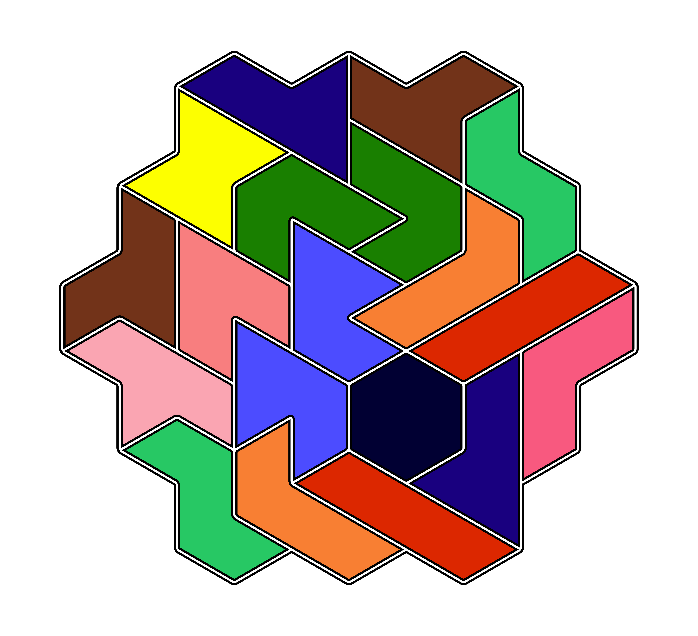

# Hexiamonds
Hexiamonds are [polyiamonds](https://mathworld.wolfram.com/Polyiamond.html) composed of six equilateral triangles. [Wolfram MathWorld](https://mathworld.wolfram.com/Hexiamond.html) gives them the names

## Eisenstein integers
The [Eisenstein integers](https://mathworld.wolfram.com/EisensteinInteger.html) are numbers of the form $a + b\omega$, where $\omega = \frac{-1 + i\sqrt{3}}{2}$. $\mathbb{Z}\[\omega\]$ is a ring whose elements form a triangular lattice.

A triangle in the lattice can be uniquely defined as a set of three Eisenstein integers, and a set of six connected triangles corresponds to a unique hexiamond position in the lattice.

## Exact cover
Knuth writes in [Dancing Links](https://arxiv.org/abs/cs/0011047)

> In the late 1950s, T. H. O'Beirne introduced a pleasant
> variation on polyominoes by substituting triangles for squares. ... O’Beirne was particularly fascinated by the fact
> that seven of the twelve hexiamonds have different shapes when they are flipped over, and that the resulting 19
> *one-sided hexiamonds* \[i.e., those distinct up to reflection\] have the correct number of triangles to form a hexagon: a hexagon of hexiamonds.

Here is one such hexagon of hexiamonds which was found and drawn by the code in this repository.

